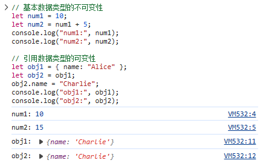
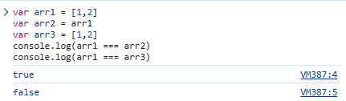

### 数据类型

- 基本数据类型（也称为原始值）：包括字符串（String）、数字（Number）、布尔值（Boolean）、Undefined和Null。
- 引用数据类型：包括对象（Object）、数组（Array）、函数（Function）、日期（Date）、正则表达式（RegExp）、Map、Set等。
- 基本数据类型和引用数据类型的不同
  - **存储方式：**在给变量赋值时，基本数据类型的值会存在**栈内存**中，可以直接访问；而引用数据类型会将值存在**堆内存**中，并且在**栈内存**里存放引用地址，通过**栈内存**的引用地址来访问值。（下面几个不同点其本质都是这个）
  - 复制方式：存储方式的不同造就复制情况的不同，如下图。不论基本数据类型还是引用数据类型，复制都是将**栈内存**里的内容进行赋值的，所以在基本数据类型赋值的时候，是将一个变量的值复制给另一个变量。而引用数据类型赋值时，是按**引用地址**复制给另一个变量，即两个变量指向同一个对象的**引用地址**。
    - 
  - 可变性：基本数据类型是不可变的，一旦创建就不可修改，对其进行操作会返回一个新的值。而引用数据类型是可变的，可以通过改变对象的属性来修改对象的值。
    - 
  - 判等方式：基本数据类型可以通过`===`（严格相等）或`==`（相等）进行判等，比较的是值是否相等。引用数据类型的判等比较的是引用地址是否相等，即两个引用是否指向同一个对象。
    - 
  - 传递方式：基本数据类型作为函数参数时，是按值传递的，即函数内部对参数的修改不会影响外部的变量。引用数据类型作为函数参数时，是按引用传递的，即函数内部对参数的修改会影响到外部的变量。

### 数据类型检测`typeof`

- `typeof`对引用数据类型会检测为 'object' ，这个'object' 并不代表对象，而是指代引用数据类型
- null为什么也是'object' ，历史遗留问题，一开始null是被当做空对象占位符发明出来的，后来null引申为出空值的意思，但是`typeof`仍然检测为'object'


### 类型转换

##### 显式类型转换

- `Number(mix)`
  - 将参数 `mix` 转换为数字类型。如果 `mix` 是一个数字字符串，将其转换为对应的数字；如果 `mix` 是一个布尔值，`true` 转换为 1，`false` 转换为 0；如果 `mix` 是一个对象，会调用该对象的 `valueOf()` 方法并尝试将返回值转换为数字；否则，返回 `NaN`。
    - 
- `parseInt(string, radix)`
  - 将字符串 `string` 转换为整数。可选参数 `radix` 表示进制，默认为 10。该方法从字符串的开头开始解析，直到遇到非数字字符为止。如果无法解析出有效的整数，则返回 `NaN`。**将目标进制转化为10进制**
    - 
- `parseFloat(string)`
  - 将字符串 `string` 转换为整数。该方法从字符串的开头开始解析，直到遇到非数字字符为止。如果无法解析出有效的浮点数，则返回 `NaN`。
- `toString(radix)`
  - 将数字转换为字符串。可选参数 `radix` 表示进制，默认为 10。该方法将数字转换为指定进制的字符串表示形式。**将10进制转化为目标进制**
    - 例题：将10101010的2进制转化为16进制
    
    - ```js
      // 数字转换为字符串
      console.log((123).tostring()); // 输出:"123"
      //指定进制数进行转换
      console.log((255).tostring(16)); // 输出: "ff"
      console.log((10).tostring(2)); // 输出:"1010"
      //特殊值转换为字符串
      console.log(nul1.tostring()); // 报错
      console.log(undefined.tostring()); //报错
      console.log(NaN.tostring()); // 输出:"NaN"
      console.1og("".tostring()); // 输出:"(空字符串)
      //可以将函数转换为字符串
      function myFunction() fconsole.log("He1lo World!");
      console.log(myFunction.tostring()); // 输出函数的源代码
      // 对象调用 tostring() 方法并尝试转换为字符串const obj1 = {tostring() (return "hello";
      console.log(obj1.tostring()); // 输出:"hello"const obj2 = {tostring() (return 789;
      console.log(obj2.tostring()); // 输出:"789"
      ```
    
      
    
    - 
- `String(mix)`
- `Boolean()`

##### 隐式类型转换

- `isNaN` 

  - 使用时，隐式调用`Number`方法，再和`NaN`进行比较

    - ```js
      // 判断非数字值
      console.log(isNaN("hello")); //Number("hello") => NaN == NaN 输出：true
      console.log(isNaN(""));  //Number("") => 0 == NaN 输出：false
      
      // 判断数字值
      console.log(isNaN(123)); //Number(123) => 123 == NaN 输出：false
      console.log(isNaN(-Infinity));//Number(-Infinity) => -Infinity == NaN 输出：false
      
      // 特殊值
      console.log(isNaN(undefined)); //Number(undefined) => NaN == NaN 输出：true
      console.log(isNaN(null)); //Number(null) => 0 == NaN 输出：false
      
      //字符串转换为数字
      console.log(isNaN("123")); //Number("123") => 123 == NaN 输出：false
      console.log(isNaN("3.14")); //Number("3.14") => 3.14 == NaN 输出：false
      console.log(isNaN("-Infinity")); //Number("-Infinity") => -Infinity == NaN 输出：false
      
      // 布尔值转换为数字
      console.log(isNaN(true)); //Number(true) => 1 == NaN 输出：false
      console.log(isNaN(false)); //Number(false) => 0 == NaN 输出：false
      ```